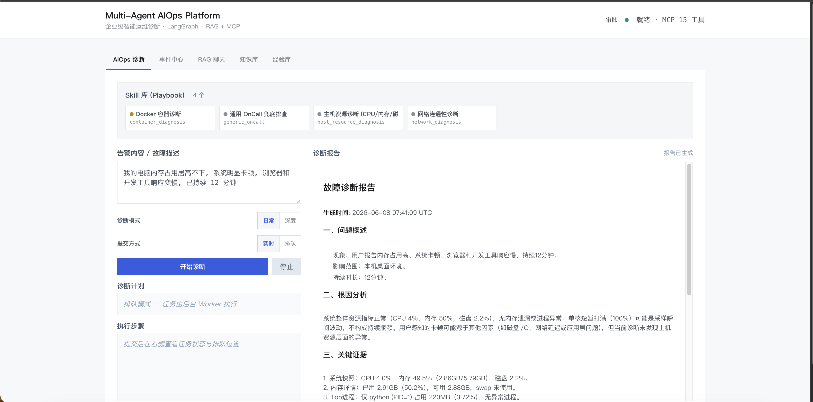
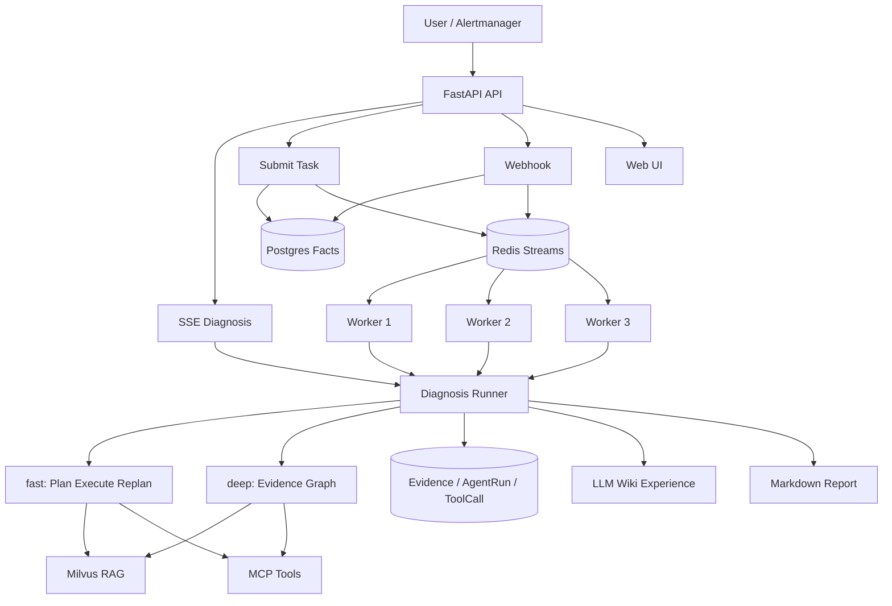

# Multi-Agent AIOps Platform V3

面向 OnCall / SRE 场景的多智能体智能运维诊断平台。当前仓库是 **V3 版本**：在原有单次 AIOps 诊断链路上，补齐 `fast / deep` 双诊断模式、后台队列、Worker、Postgres 事实库、事件中心、审批结构、经验 Wiki、RAG 评测和并发压测。

系统会把用户故障描述或 Alertmanager 告警转化为结构化诊断任务，自动选择合适的 Skill，调用 RAG 知识库和只读 MCP 工具收集证据，并输出可追溯的 Markdown 诊断报告。

[项目视频](https://www.bilibili.com/video/BV182RCBGEod/)




## V3 实际改动

V3 不是只把诊断流程换成多 Agent，而是把原来“一次请求里直接跑完诊断”的演示型链路，改成了更接近生产使用的后台化诊断系统。

| 改动方向 | V3 新增内容 | 解决的问题 |
|---|---|---|
| 高并发接入 | 新增后台诊断提交入口，请求进来后先创建任务并快速返回任务 ID | 多人同时点击诊断时，API 不再被长时间 LLM 诊断占住 |
| Postgres 事实库 | 新增 alerts、incident groups、diagnosis tasks、agent runs、tool calls、evidence、reports 等事实表 | 诊断过程不只停留在最终 Markdown，任务状态、证据链和工具调用都可以回看与审计 |
| Skill Playbook | 收敛为主机资源、网络连通性、Docker 容器、通用 OnCall 四类内置 Skill | 先选排障剧本，再限制工具白名单，减少无关上下文和误调用 |
| 队列削峰 | 新增 Redis Streams 优先级队列，告警和手动任务统一入队 | 告警洪峰不会直接打到 Agent 执行链路 |
| Worker 后台执行 | 新增多个后台 Worker 消费任务，API 只负责接入和状态查询 | 诊断执行从 API 进程里拆出来，长任务不会拖慢普通接口 |
| 全局执行限额 | 新增跨 Worker 的诊断执行槽，本地配置下 3 个 Worker 共享 2 个真实执行名额 | Worker 可以横向扩展，但 LLM / RAG / MCP 不会被同时打爆 |
| 限流保护 | 对手动提交和 Webhook 分别加固定窗口限流，超限返回 429 | 防止单个用户、IP 或告警源刷爆系统 |
| 失败恢复 | 新增 Worker 心跳、pending 任务回收、重试和死信队列 | Worker 崩溃或任务超时后，任务不会静默丢失 |
| 过程可观测 | 新增队列状态、任务状态、Worker 存活、执行槽占用、证据链和历史任务视图 | 高并发下能看到任务是在排队、执行、成功、失败还是进了 DLQ |
| 压测验证 | 新增并发压测脚本和完整压测报告 | 用实测数据说明接入能力、限流效果和真实 Worker 并发上限 |

本地压测结果显示：读接口最高测到 **3000 请求 / 200 并发** 且 100% 成功；后台诊断提交测到 **200 请求 / 100 并发**，覆盖 API 接入、Postgres 落库和 Redis 入队；Webhook 测到 **500 请求 / 100 并发**，告警可以完成接收、归一、落库和入队。真正昂贵的诊断执行没有无限放大，而是被全局执行槽限制在 **最多 2 个诊断同时运行**。完整数据见 [docs/PRESSURE_TEST_REPORT.md](docs/PRESSURE_TEST_REPORT.md)。

## V3 更新说明

V3 保留原有默认诊断流程，并把它命名为 `fast` 模式。`fast` 仍然走 Skill-first Plan-Execute-Replan 链路：

```text
Skill Router
    -> Planner
    -> Executor
    -> Replanner
    -> Report
```

同时，V3 新增 `deep` 模式。`deep` 不复用 fast 的 Planner，而是走另一条独立诊断图，适合需要多类证据交叉验证的复杂 RCA。它不是让多个 LLM 无约束互聊，而是用 LangGraph 做确定性编排：先规划取证域，再并行派出多个专业 subagent，各自隔离调查，最后只把压缩后的 Evidence 写回共享状态。

```text
IncidentManager
    -> CorrelationContext
    -> EvidencePlan
    -> MetricAgent / LogAgent / InfraAgent / RunbookAgent
    -> EvidenceReducer
    -> RCAJudge
    -> RemediationPlanner
    -> ReportAgent
```

两种模式共用 RAG、MCP 工具、Evidence、SSE 事件和报告输出。V3 的重点不是单纯“多几个 Agent”，而是把原来的演示型诊断链路升级成更接近生产形态的 AIOps 工作台。

```text
基础版：
用户点开始诊断
    -> FastAPI 接住请求
    -> API 进程当场跑 Agent
    -> 当场生成报告
    -> 浏览器里看到结果

V3：
用户点开始诊断 / 告警进来
    -> FastAPI 接收任务
    -> Redis Streams 负责排队
    -> Worker 负责真正跑诊断
    -> Postgres 保存任务、事件、证据和报告
    -> 前端查看进度、历史、证据链和评测结果
```

### V3 与基础版差异

| 维度 | 基础版 | V3 |
|---|---|---|
| 诊断入口 | 用户请求进来后，API 自己直接跑诊断 | API 可同步跑，也可提交后台任务 |
| 任务排队 | 无真实任务队列 | Redis Streams 优先级队列 |
| 后台执行 | API 进程自己跑 Agent | 独立后台 Worker 消费队列任务 |
| 任务保存 | 主要看最终报告 | Postgres 保存任务、事件、证据、工具调用和报告 |
| 高并发 | 更适合单人演示或少量请求 | 分布式并发槽、Worker 心跳、pending 回收、DLQ |
| 诊断深度 | 默认 Plan-Execute-Replan 流程 | `fast` 沿用原流程，`deep` 使用独立 Evidence Graph |
| 证据链 | 前端可看过程，但审计较轻 | AgentRun / ToolCall / Evidence 可追溯 |
| 历史经验 | 主要靠 RAG 文档和 SOP | LLM Wiki 将诊断经验沉淀为 Markdown，下次可召回 |
| 前端页面 | 诊断、RAG 聊天、知识库 | 增加事件中心、队列状态、任务详情、证据链、经验库、评测报告 |
| 测试方式 | 单次 mock 或 benchmark | 新增并发压测脚本和队列测试文档 |

## 项目亮点

- **Skill-first 诊断链路**：先识别故障类型，再加载对应 Playbook、SOP 摘要和工具白名单，减少无关上下文和误调用。
- **fast / deep 双诊断模式**：`fast` 走 Plan-Execute-Replan 快速闭环，`deep` 走独立多 Agent 证据图，适合复杂 RCA。
- **后台任务队列**：支持同步 SSE 诊断，也支持 Redis Streams 入队，由多个 Worker 后台消费。
- **诊断事实库**：Postgres 保存告警、事件、任务、证据、AgentRun、ToolCall 和最终报告，便于回看与审计。
- **RAG 知识库增强**：Parent-Child chunking、结构保护、Vector + BM25、RRF 融合、本地 rerank。
- **MCP 工具接入**：系统、网络、Docker、WebSearch、Windows 日志等工具通过 MCP 服务统一接入。
- **权限与审批边界**：默认偏只读诊断，高风险工具可接入人工审批流程。
- **可量化评测**：内置 50 题检索评测、50 题 RAGAS / OpenEvals 端到端评测和并发压测脚本。

## 架构概览



## 诊断流程

```text
用户告警 / 故障描述
    -> Skill Router 选择故障类型
    -> 加载对应 Skill Playbook 和工具白名单
    -> Planner 生成诊断计划
    -> Executor 调用 RAG 和 MCP 只读工具
    -> Replanner 判断继续、调整或收敛
    -> Report 生成结构化诊断报告
```

### Skill / Playbook 层

Skill 是面向故障类型的排障剧本，不是单个工具，也不是一段简单 Prompt。它定义“适用什么场景、按什么顺序排查、允许调用哪些工具、报告应该关注什么”。V3 当前内置 4 个公开 Skill：

| Skill | 适用场景 | 工具边界 |
|---|---|---|
| `host_resource_diagnosis` | CPU、内存、磁盘、OOM、本机卡顿 | 本机系统快照、CPU / 内存、磁盘、Top 进程、知识库 |
| `network_diagnosis` | 网站打不开、接口超时、DNS 异常、端口不通 | DNS、HTTP、端口、Ping、知识库和有限联网搜索 |
| `container_diagnosis` | Docker 容器挂掉、重启循环、资源占用高、启动失败 | Docker 状态、资源、日志、inspect；写操作需要审批边界 |
| `generic_oncall` | 现象不明确或多组件复合故障 | 通用只读工具集合，作为兜底排障剧本 |

诊断开始时，Skill Router 先根据用户输入和告警内容选择剧本；Executor 只能看到该 Skill 白名单里的工具。这样既保留 Agent 的灵活性，也避免 LLM 在无关工具之间漫游。

`deep` 模式不复用 fast 的 Planner，而是使用独立诊断图：

```text
IncidentManager
    -> CorrelationContext
    -> EvidencePlan
    -> MetricAgent / LogAgent / InfraAgent / RunbookAgent
    -> EvidenceReducer
    -> RCAJudge
    -> RemediationPlanner
    -> ReportAgent
```

## deep 多 Agent 设计

V3 新增的 `deep` 模式把一次诊断拆成“上下文构建、证据规划、专业 Agent 并行取证、证据归并、根因裁决、处置建议、报告生成”几个阶段。核心目标是：**让不同专业 Agent 分工取证，但避免多个 Agent 互相聊天导致上下文失控**。

### 编排方式

```text
IncidentManager
    载入 task / incident / group 信息

CorrelationContext
    聚合同组告警、相邻事件和 LLM Wiki 历史经验

EvidencePlan
    根据故障现象识别取证域，决定派哪些专业 Agent

fan-out 并行取证
    MetricAgent / LogAgent / InfraAgent / RunbookAgent

EvidenceReducer
    归并、去重、打分，生成候选根因

RCAJudge
    只看结构化候选和 evidence summary，排序并判定根因

RemediationPlanner
    生成处置建议；高风险写操作必须走人工确认

ReportAgent
    输出引用 evidence_id 的最终报告
```

### 专业 Agent 分工

| Agent | 负责内容 | 主要数据源 / 工具 | 输出 Evidence |
|---|---|---|---|
| `MetricAgent` | CPU、内存、磁盘、进程、Prometheus 指标异常 | Prometheus 工具优先，本机 system MCP 兜底 | `metric_snapshot` |
| `LogAgent` | 日志模式、告警规则、错误特征匹配 | RAG 知识库中的 Prometheus 告警、loghub 模板、SOP | `log_excerpt` |
| `InfraAgent` | 运行环境、容器状态、端口、DNS / HTTP 健康和基础依赖 | 本机 system 工具，Docker / Network MCP 只读工具 | `infra_snapshot` |
| `RunbookAgent` | 标准 SOP、排查流程、处理步骤 | RAG 知识库中的 Redis / MySQL / 通用 OnCall SOP | `runbook_match` |

### 为什么这样做

- **隔离上下文**：每个专业 Agent 只读自己的 scoped 输入和工具白名单，中间推理不写入共享 state。
- **Evidence 黑板**：Agent 之间不互聊，只把压缩后的 Evidence 写到 `state.evidences`；并行写入通过 LangGraph reducer 安全归并。
- **按需派遣**：`EvidencePlan` 用规则路由选择 Agent。资源类问题优先派 `MetricAgent`，日志/错误类问题派 `LogAgent`，容器/端口/DNS/HTTP/依赖健康类问题派 `InfraAgent`，SOP 类问题派 `RunbookAgent`；没有明显命中时默认 `metric + log`。
- **fan-out / fan-in**：专业 Agent 并行取证，`EvidenceReducer` 作为 join barrier 统一收口。
- **结构化裁决**：`RCAJudge` 不直接读取原始日志或指标大文本，只看候选根因和 evidence summary，降低幻觉和 prompt 膨胀。
- **失败可降级**：单个 Agent 工具失败不会拖垮整条 deep graph；失败会变成带 `error_type` 的 Evidence，让报告能说明信息缺失。

这套设计让 `deep` 更像一个“有分工、有汇总、有审计”的诊断小组：专业 Agent 负责取证，Reducer 负责收敛证据，RCAJudge 负责最终判断，ReportAgent 负责把证据链写清楚。

## RAG 与 Benchmark

RAG 链路按 OnCall 场景做了结构保护和可评测设计：

```text
Markdown / SOP / Alert 语料
    -> 标题层级切分
    -> Parent-Child chunking
    -> child 写入 Milvus HNSW 向量索引
    -> Vector + BM25 双路召回
    -> RRF 融合
    -> 本地 bge-reranker-v2-m3 精排
    -> 返回 top-k parent 上下文给 LLM
```

检索侧 50 题结果：

| 配置 | Hit | MRR | Recall |
|---|---:|---:|---:|
| `Recall@3`, `bm25_weight=0.4` | 1.000 | 0.930 | 1.000 |
| `Recall@5`, `bm25_weight=0.4` | 1.000 | 0.930 | 1.000 |

BM25 权重对比：

| BM25 权重 | Hit@3 | MRR@3 | Recall@3 |
|---:|---:|---:|---:|
| 0.0 | 0.94 | 0.89 | 0.94 |
| 0.1 | 0.94 | 0.89 | 0.94 |
| 0.2 | 0.94 | 0.89 | 0.94 |
| 0.3 | 0.94 | 0.89 | 0.94 |
| **0.4** | **1.00** | **0.93** | **1.00** |
| 0.5 | 1.00 | 0.93 | 1.00 |

RAGAS / OpenEvals 50 题结果：

| faith | rel | cprec | crecall | ground | help |
|---:|---:|---:|---:|---:|---:|
| 0.913 | 0.936 | 0.997 | 0.871 | 0.994 | 0.872 |

评测入口：

```bash
python benchmark/run_benchmark.py retrieval --k 3
python benchmark/run_benchmark.py ragas --limit 5
```

更多说明见 [benchmark/README.md](benchmark/README.md)。

## 并发与队列设计

V3 解决并发问题的核心思路是：**API 只负责快速接收任务，重诊断交给队列和 Worker；真正昂贵的诊断执行再由全局并发槽限速**。

### 压力来源拆解

AIOps 系统里的“压力”不是一种压力，而是多条链路同时受压。V3 把它们分开处理，避免所有压力都挤到 Agent 执行阶段。

| 压力来源 | 典型场景 | 风险 | V3 的处理方式 |
|---|---|---|---|
| 用户请求压力 | 多人同时点击诊断、重复提交同类问题 | API 线程被长任务占住，页面迟迟无响应 | 同步诊断和后台诊断分流；高并发场景走后台提交，API 快速返回任务 ID |
| 告警洪峰压力 | Alertmanager 一次推送大量 firing 告警 | 告警入口阻塞，任务重复创建 | Webhook 只做校验、归一、去重、入库和入队，不在入口直接跑诊断 |
| 队列堆积压力 | 短时间提交任务多于 Worker 可消费能力 | 任务越积越多，用户不知道是否还在处理 | 队列保存 backlog，前端展示队列位置、队列深度、pending、lag 和 DLQ |
| Worker 执行压力 | 多个 Worker 同时跑 Agent | LLM、RAG、MCP、数据库被并发执行打满 | 所有 Worker 共享全局执行上限，Worker 可以多，但真正运行的诊断数可控 |
| LLM 成本和配额压力 | 多任务同时规划、执行、复盘、生成报告 | token 成本失控，模型 RPM/TPM 被打满 | prompt 收敛、模型分层、最大步骤数、执行并发槽、token usage 统计共同控制 |
| RAG / 向量库压力 | 多个诊断同时检索知识库、rerank | Milvus、Embedding、reranker 延迟升高 | 后台执行限额间接保护检索链路；RAG 参数固定可评测，避免无限扩大召回 |
| MCP 工具压力 | 多个诊断同时查系统、网络、Docker、WebSearch | 工具服务被频繁调用，外部依赖抖动 | Skill 工具白名单、只读工具并行上限、失败降级，避免无限工具漫游 |
| 数据库写入压力 | 大量任务、证据、工具调用同时落库 | 连接池耗尽，任务状态写入失败 | Postgres 作为事实库，任务状态分阶段写入；Redis 只保存运行态队列 |
| 前端长连接压力 | 多个同步 SSE 诊断同时流式输出 | 连接占用时间长，影响 API worker | 同步 SSE 适合少量即时诊断；批量或高并发场景使用后台任务和事件中心查看结果 |

### 并发治理方式

V3 把并发治理拆成六层，每一层解决一个不同的问题：

| 层级 | 解决的问题 | 做法 |
|---|---|---|
| 接入层削峰 | 用户请求和告警洪峰不能直接压到 Agent 执行链路上 | API 收到诊断请求后只做参数校验、任务落库和入队，然后立即返回任务 ID；真正耗时的诊断异步执行 |
| 队列缓冲 | 短时间大量任务需要排队，而不是把服务打满 | 任务进入优先级队列，按 `critical / high / normal / low` 分层消费；高优先级告警可以先被 Worker 领取 |
| 执行层限额 | Worker 可以横向扩展，但 LLM、RAG、MCP 工具都有成本和配额 | 所有 Worker 共享同一个全局执行上限，例如 3 个 Worker 存活时，仍然只允许 2 个诊断同时真正运行 |
| 接口限流 | 防止单个用户、IP 或告警源刷爆系统 | 对同步诊断、后台提交和 Webhook 分别做固定窗口限流；超过窗口上限直接返回 429 |
| 失败恢复 | Worker 崩溃、任务超时或执行失败不能造成任务永久丢失 | 已领取未确认的任务可被重新认领；超过重试次数后进入死信队列，便于人工排查 |
| 可观测闭环 | 并发治理必须能被看见，否则很难调参 | 队列深度、pending、lag、DLQ、Worker 存活、执行槽占用都会暴露到队列状态接口和前端面板 |

这套模式的关键点是：**并发请求数量、排队任务数量、真实诊断执行数量是三件不同的事**。V3 允许短时间接收更多请求，但把昂贵的诊断执行收敛到一个可控上限内，从而保护 LLM 配额、数据库、向量检索和 MCP 工具服务。

```text
请求洪峰
    -> 快速入队
    -> 队列削峰
    -> Worker 按优先级领取
    -> 全局执行槽限制真实诊断并发
    -> 成功 ACK / 失败重试 / 超限进 DLQ
```

### 本地并发压测

完整压测报告见 [docs/PRESSURE_TEST_REPORT.md](docs/PRESSURE_TEST_REPORT.md)。

测试环境：

- Docker Compose 启动 API + 3 个 Worker
- `WORKER_DIAGNOSIS_CONCURRENCY=2`
- `MANUAL_DIAGNOSIS_CONCURRENCY=2`
- `EXECUTOR_MAX_PARALLEL=6`

#### 1. API 读压上限

只压 `/api/v1/queue/status`，不创建任务、不调用 LLM，用来观察 API + Redis 状态查询链路的读压能力。

| 请求数 | 并发 | 成功率 | 吞吐 | P50 | P95 | P99 |
|---:|---:|---:|---:|---:|---:|---:|
| 1000 | 100 | 100% | 367.7 req/s | 221ms | 582ms | 645ms |
| 3000 | 200 | 100% | 136.2 req/s | 1163ms | 3795ms | 5046ms |

结论：100 并发读压下吞吐更高；提升到 200 并发后仍全部成功，但延迟明显上升，说明瓶颈开始出现在 Redis-backed 队列状态查询和本机容器资源上。

#### 2. 写入接入压力

临时停掉 Worker，只测试 API 入队、Postgres 落库、Redis 队列写入，不触发大批 LLM 执行。

| 场景 | 请求数 | 并发 | 成功率 | 总耗时 | 吞吐 | P50 | P95 | P99 |
|---|---:|---:|---:|---:|---:|---:|---:|---:|
| 后台诊断提交 | 200 | 100 | 100% | 2.03s | 98.3 req/s | 980ms | 1068ms | 1094ms |
| Alertmanager Webhook | 500 | 100 | 100% | 2.54s | 197.0 req/s | 359ms | 1633ms | 1864ms |

观察结果：

- 200 个后台诊断任务全部成功入队。
- 500 条 Webhook 告警全部成功接收、归一、落库并进入优先级队列。
- 压测期间 Worker 关闭，因此这些任务只验证接入、落库和削峰能力，不消耗大批 LLM。
- 压测结束后清理测试任务，再恢复 Worker，队列回到 `depth=0 pending=0 dlq=0`。

#### 3. 接口限流测试

同一调用方并发提交 40 个 `/api/v1/aiops/diagnose/submit` 请求，验证默认 `RATE_LIMIT_MANUAL_PER_IP_PER_MIN=20` 是否生效。测试时临时停掉 Worker，只测 API 入队和限流，不触发大批 LLM 执行。

| 请求数 | 并发 | 2xx | 429 | 总耗时 | 吞吐 | P95 | P99 |
|---:|---:|---:|---:|---:|---:|---:|---:|
| 40 | 40 | 20 | 20 | 0.94s | 42.5 req/s | 928ms | 930ms |

结论：前 20 个请求成功进入队列，超过单 IP 窗口上限的请求返回 429，API 仍保持健康。

#### 4. 真实 Worker 执行验证

`python scripts/loadtest.py submit --n 8 --concurrency 8 --severity mix`

这组会让 Worker 真实消费任务并调用诊断链路，用来验证队列削峰和全局执行槽，而不是追求请求数上限。

| 指标 | 结果 |
|---|---:|
| 总请求 | 8 |
| 成功请求 | 8 / 8 |
| 429 限流 | 0 |
| 总耗时 | 0.87s |
| 吞吐 | 9.1 req/s |
| 平均延迟 | 680ms |
| P50 | 747ms |
| P95 | 874ms |
| P99 | 874ms |

队列与 Worker 观察：

| 观察项 | 结果 |
|---|---|
| 压测前队列 | `depth=0 pending=0 lag=0 dlq=0` |
| 压测后瞬时队列 | `depth=8 pending=3 lag=5 dlq=0` |
| 活跃 Worker | 3 |
| 诊断执行槽 | 最高保持 `worker_diagnosis=2/2` |
| 排空结果 | `depth=0 pending=0 lag=0 dlq=0` |
| 任务落库结果 | 最近一轮 8 个任务全部 `succeeded` |

Worker 专项补测：

| 测试项 | 结果 |
|---|---:|
| 提交任务数 | 6 |
| 成功任务数 | 6 |
| 活跃 Worker | 3 |
| 参与执行的 Worker | 3 |
| 任务状态 `running` 峰值 | 3 |
| 真实执行槽峰值 | `2/2` |
| 队列最终状态 | `depth=0 pending=0 dlq=0` |
| 首个任务创建到最后任务完成 | 约 98s |

说明：`running=3` 表示 3 个 Worker 都领取了任务并进入执行流程，包含正在等待全局执行槽的任务；但真实诊断执行槽始终不超过 `2/2`，因此当前配置下最多只有 **2 个诊断同时真正运行**，第 3 个 Worker 会等待槽位释放。

这个结果说明：API 可以并发接收任务并快速返回；任务会在 Redis Streams 中削峰排队；即使 3 个 Worker 同时存活，真正执行诊断的并发也被 Redis 全局槽限制在 2 个，不会随着 Worker 或 Uvicorn 进程数线性放大。

## 快速开始

### 1. 准备环境

需要：

- Python 3.11+
- Docker / Docker Compose
- 一个 OpenAI-compatible Chat 模型 API Key，例如 DeepSeek 或 DashScope
- 如使用本地 embedding，需准备 Ollama 和 `bge-m3`

```bash
git clone <your-repo-url>
cd <repo>
python -m venv .venv
source .venv/bin/activate
pip install -r requirements.txt
cp .env.example .env
```

编辑 `.env`，至少配置一个可用模型：

```env
DEEPSEEK_API_KEY=your-deepseek-api-key
# 或
DASHSCOPE_API_KEY=your-dashscope-api-key

KB_ADMIN_TOKEN=change-this-admin-token
```

### 2. 启动基础设施

```bash
docker compose up -d
```

这会启动 Milvus、Redis、Postgres、Attu 和 open-webSearch。

### 3. 导入知识库

```bash
python scripts/ingest_kb_corpus.py --dry-run
python scripts/ingest_kb_corpus.py --reset
```

如需重新生成 Prometheus 告警语料：

```bash
powershell -ExecutionPolicy Bypass -File scripts/fetch_kb_corpus.ps1
python scripts/convert_prometheus_alerts.py
```

### 4. 启动应用

macOS / Linux：

```bash
bash scripts/run_all.sh
```

Windows PowerShell：

```powershell
powershell -NoProfile -ExecutionPolicy Bypass -File .\run.ps1
```

容器化启动 API + Worker：

```bash
docker compose --profile app up -d --build
```

停止本地脚本启动的服务：

```bash
bash scripts/stop_all.sh
```

## 访问地址

| 页面 | 地址 |
|---|---|
| Web UI | http://localhost:9900 |
| Swagger | http://localhost:9900/docs |
| ReDoc | http://localhost:9900/redoc |
| 健康检查 | http://localhost:9900/api/v1/health |
| 就绪检查 | http://localhost:9900/api/v1/health/ready |
| 队列状态 | http://localhost:9900/api/v1/queue/status |
| Attu Milvus UI | http://localhost:8000 |

## 使用示例

本机诊断：

```text
我电脑很卡，帮我看下是不是 CPU 或内存太高
```

Redis 告警诊断：

```text
Redis 实例 redis-master-01 内存使用率 98%，客户端连接被强制断开
```

Alertmanager Webhook 模拟：

```bash
python scripts/mock_alert.py --scenario redis
python scripts/mock_alert.py --list-history
```

并发压测：

```bash
python scripts/loadtest.py submit --n 100 --concurrency 20
python scripts/loadtest.py webhook --n 500 --concurrency 100
```

## API 概览

| 功能 | 方法 | 路径 |
|---|---|---|
| AIOps 诊断，SSE | POST | `/api/v1/aiops/diagnose` |
| 后台诊断提交 | POST | `/api/v1/aiops/diagnose/submit` |
| 队列状态 | GET | `/api/v1/queue/status` |
| Alertmanager Webhook | POST | `/api/v1/webhook/alertmanager` |
| RAG Chat | POST | `/api/v1/chat/stream` |
| Skill 列表 | GET | `/api/v1/skills` |
| 上传文档 | POST | `/api/v1/documents/upload` |
| 文档列表 | GET | `/api/v1/documents` |
| 删除文档 | DELETE | `/api/v1/documents/{source}` |
| 健康检查 | GET | `/api/v1/health` |
| 就绪检查 | GET | `/api/v1/health/ready` |

知识库上传和删除需要请求头：

```http
X-KB-Admin-Token: your-admin-token
```

## 项目结构

```text
.
├── app/                    # FastAPI / Agent / RAG / Skill 核心代码
├── benchmark/              # 检索与 RAGAS 评测集、评测脚本、汇总报告
├── data/kb_corpus/         # RAG 开源语料
├── data/wiki/              # 运行时经验 Wiki 模板；诊断流水不提交
├── docs/sop/               # Redis / MySQL / 通用告警 SOP
├── frontend/               # Web UI
├── mcp_servers/            # MCP 工具服务
├── open-webSearch-main/    # 本地联网搜索服务
├── scripts/                # 启动、导入、压测和告警模拟脚本
├── docker-compose.yml
├── Dockerfile
├── requirements.txt
└── run.ps1
```

## 数据与隐私

仓库保留源码、文档、公开语料和 benchmark 记录。以下内容不应提交：

- `.env`、`.env.*` 中的 API Key 和本地配置
- `volumes/`、数据库卷、Redis / Milvus / MinIO 本地状态
- `data/wiki/index.md`、`data/wiki/log.md`、`data/wiki/services/`、`data/wiki/patterns/` 等运行时诊断经验
- `.idea/`、`.vscode/`、`.claude/`、`__pycache__/`、日志和临时文件

## 版本演进

README 保留这部分，是为了说明当前仓库为什么叫 V3，以及 V3 相比早期版本多了哪些工程能力。

### 基础诊断链路

早期版本聚焦单次诊断：用户输入故障描述后，系统在一次请求内完成 Skill Router、Planner、Executor、Replanner 和 Report。这个版本已经具备可演示的 AIOps Agent 闭环，但任务持久化、后台消费、证据审计和高并发能力较弱。

### V2：AgentHarness 与本地 WebSearch

V2 没有改变主流程拓扑，重点是把分散在各模块里的 prompt、模型选择、预算统计、降级和 reroute 策略收敛到 `app/runtime/agent_harness.py`。这样 Router、Planner、Executor、Replanner、Report、RAG Chat 等阶段可以统一管理模型和运行策略。

V2 同时把联网搜索从外部 Tavily 依赖切换为本地 [open-webSearch](https://github.com/Aas-ee/open-webSearch) daemon，并接入 Docker Compose 和启动脚本，减少对额外搜索 API Key 的依赖。

### V3：后台化、审计和评测

V3 是当前主版本，主要增强点包括：

- **双诊断模式**：`fast` 负责快速诊断，`deep` 负责多 Agent 证据归并和 RCA。
- **任务后台化**：`/api/v1/aiops/diagnose/submit` 提交任务，Redis Streams 排队，Worker 后台消费。
- **事实库审计**：Postgres 保存 alerts、incident groups、diagnosis tasks、agent runs、tool calls、evidence 和 reports。
- **事件工作台**：前端增加事件中心、任务详情、队列状态、证据链、审批浮层和评测报告。
- **权限边界**：默认只读诊断，高风险操作通过 permission mode 和 approval requests 留出人工确认入口。
- **经验沉淀**：`app/wiki/` 使用轻量 LLM Wiki，把诊断结果合并为 Markdown 经验页；运行时内容不提交到仓库。
- **检索评测**：`benchmark/` 保留检索侧 Recall@K、端到端 RAGAS / OpenEvals 数据和汇总报告。
- **并发测试**：`scripts/loadtest.py` 和 `docs/CONCURRENCY_TEST_GUIDE.md` 覆盖 submit、webhook、队列 backlog、pending、DLQ 和限流验证。

### V3 保留与取舍

V3 继续保留 Skill-first 思想、Plan-Execute-Replan 主链路、MCP 工具协议、Parent-Child RAG 和 Milvus 检索底座。相比更重的知识图谱或自动生成 Skill 方案，当前版本更偏向“可运行、可观测、可评测”的工程落地：先把诊断任务跑稳、把证据留住、把效果量化，再继续扩展更多数据源和自动处置能力。

## License 与来源

本项目代码以 **MIT License** 发布。

项目集成或参考了以下第三方开源资产，公开发布时请遵守各自的许可与署名要求：

- [Aas-ee/open-webSearch](https://github.com/Aas-ee/open-webSearch)：本地联网搜索 daemon，本仓库副本位于 `open-webSearch-main/`。
- [samber/awesome-prometheus-alerts](https://github.com/samber/awesome-prometheus-alerts)：Prometheus 告警语料来源，原始内容遵循 CC BY 4.0。
- 小林 OnCall Agent 项目：参考 OnCall Agent 场景设计、诊断流程和项目表达方式。
